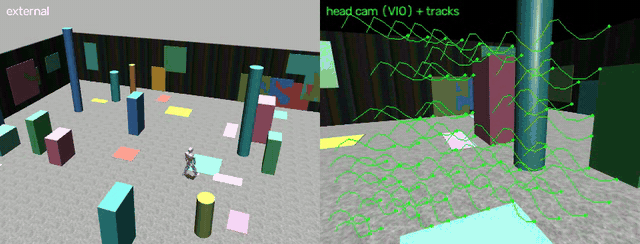

# humanoid-asimov

A monocular-camera + IMU + leg-odometry **state estimator** with **online self-calibration** for a
bipedal humanoid in MuJoCo simulation — validated against embedded-systems sensor noise and closed
around a **navigation** slice.



*Left: the robot walks a closed loop. Right: its one head camera, overlaid with the feature tracks the VIO
front-end uses to correct heading drift. Everything below runs from these onboard sensors alone — one
monocular camera + IMU + joint encoders, no depth, stereo, or lidar.*

Locomotion is treated as a black box (a separate velocity-command-following controller). This project
owns **state estimation + navigation** — the layer that answers *"where is the robot, how is it moving,
and how does it reach a goal?"* from a single camera + IMU + joint encoders, with no external motion
capture. Every filter Jacobian is finite-difference-verified in-repo. **[Explore the live dashboard →](https://jwl-robotics.github.io/humanoid-asimov/)**

## The arc — each stage's limitation motivates the next

| stage | what it adds | headline result |
|---|---|---|
| **1 · Contact-aided ESKF** | 18-state error-state EKF: IMU predict + no-slip contact-velocity update + online gyro/accel/slip biases | 0.32% drift — but **heading is unobservable** from IMU + contact alone |
| **2 · Monocular VIO** | anchored relative-rotation on a stochastically-cloned rotation state (loosely-coupled, gauge-safe); front-end sharpened to an honest ~2 mrad by an IRLS refit of (R, t) on all inliers | **beats the ESKF on every seed** (~0.15% vs ~0.49% median drift over 5 seeds); pins the yaw drift *and* the gyro-z bias the ESKF cannot see — over 3 laps with an uncalibrated gyro bias the gap is visual: yaw 17° / 7° / 1° (leg-odom / ESKF / VIO), close-gap 99 / 45 / 11 cm |
| **3 · Online self-calibration** | camera-mount extrinsic + camera–IMU time offset, estimated live (error state 21→25) | recovers an injected 3.1° mount error **87%** on the observable axis; the covariance honestly flags what a yaw-loop can't pin |
| **3b · Active calibration** | gentle neck-pitch "look-around" scan while walking; mount **and** clock offset estimated against injected errors (3.1° + 10 ms) | the sharpened front-end **survives the scan** (success flat ~74–77%); a ~5°·0.3 Hz scan halves the weak-axis funnel *and* error (σ 7.5→4.2 mrad, 15.5→7.3 mrad); td recovers to +0.6 ms even with no scan — the gait ripple already excites it |
| **4 · Sim-to-real noise** | embedded pipeline: encoder/IMU quantization, sequential-CAN stagger, transport latency, jitter | **timing dominates, amplitude is negligible** — 5 ms of latency costs ~6× the drift (0.32% → 2.04%); quantization does nothing |
| **4b · Delay compensation** | source capture timestamps + buffer-and-replay fusion: a ~200 ms rolling state/covariance/IMU history; late measurements fuse *at their stamp* and replay forward | **the timing damage is fully recovered** — every latency/stagger row collapses to ≤ the 0.32% baseline (15 ms: 6.46% → 0.23%, and 3-seed corruption-draw medians hold 0.21–0.24% compensated while naive swings to 3.2–3.9%), drift stays flat out to 20 ms, and the contact-NIS consistency returns to clean; zero delay reduces bit-for-bit to the naive loop |
| **5 · Navigation slice** | waypoint planner → `VelocityCommand(vx, vy, vyaw)` on the *estimated* state | reaches **4/4 waypoints closed-loop**; the estimate-vs-truth gap *is* the yaw drift VIO removes |
| **5b · Closed-loop showdown** | the same 3-circuit course under four configs, each steering on its own estimate: ESKF, **VIO fused inside the loop** (2 Hz keyframes), and online 5 ms latency + CAN stagger fused naive vs **replay-compensated** — judged on true closest-approach per waypoint + est-vs-truth gap (final-position error is flattered by the course returning home) | replay compensation restores the clean numbers *in the loop* (terminal yaw 5.7°→3.7°, gap max 86→76 cm); the decisive closed-loop failure is **contact over-trust, not latency** — at σ_contact 0.05 the ESKF finishes 10/12 waypoints with 98° terminal yaw, in-loop VIO rescues it to 12/12 @ 17°, and the Stage-2 σ=0.15 lesson fixes it outright |

Full write-ups live in [`docs/`](docs/) and the living, self-contained dashboard at
[`docs/dashboard/index.html`](docs/dashboard/index.html) (open it in a browser — offline, no build step).

## Layout
```
src/humanoid_asimov/   sim harness (scene, walk, sensors) + estimator, vio, calib, vision, embedded, nav
scripts/               per-stage entry points (run_*.py) + FD Jacobian checks (check_*.py) + viewers (view_*.py)
docs/                  design notes, per-stage reviews, and docs/dashboard/ (living overview + deep-dives)
data/                  logged onboard sensors + ground truth (walk_dataset.npz)
external/              vendored robot model (fetched at setup, not committed)
```

## Setup
Requires Python 3.12+ and [uv](https://docs.astral.sh/uv/).
```bash
uv sync                       # create the venv + install dependencies
bash scripts/fetch_model.sh   # fetch the open Asimov MuJoCo model (sparse, ~60 MB)
```

## Run
```bash
# --- the stack, stage by stage (each prints metrics + saves a plot to renders/) ---
.venv/bin/python scripts/run_walk.py        # Stage 0 — generate the walking dataset first (data/walk_dataset.npz)
.venv/bin/python scripts/run_estimator.py   # Stage 1 — contact-aided ESKF vs leg-odometry
.venv/bin/python scripts/run_vio.py         # Stage 2 — monocular VIO (the clean drift win)
.venv/bin/python scripts/run_calib.py       # Stage 3 — recover an injected camera-mount error online
.venv/bin/python scripts/run_neckscan.py    # Stage 3b — active calibration: neck-scan sweep (mount + td unfrozen)
.venv/bin/python scripts/run_embedded.py    # Stage 4 — which embedded noise actually hurts (ablation)
.venv/bin/python scripts/run_timing.py      # Stage 4b — the same grid with buffer-and-replay delay compensation
.venv/bin/python scripts/run_nav.py         # Stage 5 — closed-loop waypoint navigation on the estimate
.venv/bin/python scripts/run_nav5b.py all   # Stage 5b — the closed-loop showdown (4 configs, 3 circuits)
.venv/bin/python scripts/run_vio.py multilap  # 3-lap Win figures + data for the vio.html interactive chart

# --- verification (finite-difference Jacobian checks — the discipline behind every filter) ---
.venv/bin/python scripts/check_eskf_jacobian.py
.venv/bin/python scripts/check_vio_jacobian.py
.venv/bin/python scripts/check_calib_jacobian.py

# --- interactive viewers (macOS: mjpython handles the main-thread GUI; Linux/Windows: python) ---
.venv/bin/mjpython scripts/view_loop.py     # watch the robot walk the loop (cycle cameras: C / Tab / [ ])
.venv/bin/mjpython scripts/view_vio.py      # live KLT feature tracks the VIO front-end sees

# --- tests + dashboard ---
.venv/bin/python -m pytest -q
open docs/dashboard/index.html              # living dashboard (offline, self-contained)
```
`data/walk_dataset.npz` is the logged onboard sensors + ground truth (the estimator's input + eval
target). Locomotion here is a **development stand-in** (PD-tracked gait + a load-bearing torso support),
not true dynamic walking — see [`docs/DESIGN.md`](docs/DESIGN.md) and `docs/STAGE0_REVIEW.md`.

## Acknowledgements
Built on the open-source **Asimov** humanoid MuJoCo model
([`asimovinc/asimov-1`](https://github.com/asimovinc/asimov-1), CERN-OHL / GPL). The model is fetched at
setup, not redistributed here.
